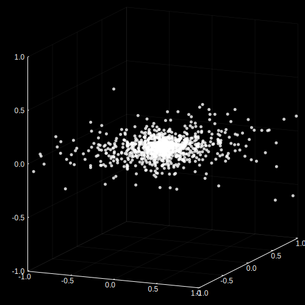
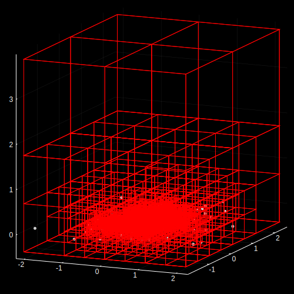

# ParallelBarnesHut.jl
A parallel Barnes Hut package for Julia. Note that currently, the following examples do not use initial conditions which are particlarly accurate for learning about an actual galaxy, but the user can create custom initial particle distributions.

More tools, such as better initial distribution generators, dark matter particles, and plots of total energy and angular momentum over time would be useful additions in the future.

## Installing
Run the following code in Julia to install the ParallelBarnesHut package:
```julia
import Pkg; Pkg.add(Pkg.PackageSpec(url = "https://github.com/alexhad6/ParallelBarnesHut.jl"))
using ParallelBarnesHut
```
It will take some time to install and precompile.

## Documentation

This documentation can also be accessed in Julia using the search feature, which is a question mark followed by the name of the object or function to learn about. See [ParallelBarnesHut.jl](src/ParallelBarnesHut.jl) for source code.

##### `Particle(pos, vel, mass)`
Julia `struct` that represents a particle in a Barnes Hut simulation. For a galaxy simulation, a particle is a star or a group of stars.
- `Particle.pos`: position coordinates of a particle (in meters).
- `Particle.vel`: velocity vector of a particle (in meters per second).
- `Particle.mass`: mass of a particle (in kilograms).

##### `simulate!(particles, steps; Δt = 0.1, θ = 0.5, acc_func = grav_acc)`
Approximately solve N-body problem for an array of particles for a number of time steps into the future using the Barnes Hut method. Optionally specify `Δt`, the length of a time step in seconds, `θ`, the node size to distance threshold for the Barnes Hut algorithm, and the acceleration function. Return an array of particle arrays, where each particle array is the state of all particles at each time step.

##### `grav_acc(mass, r; ϵ = 0.02)`
Calculate the gravitation acceleration on a particle given the mass of another object and the distance vector from particle to object. The usual gravitational force is softened by a factor `ϵ` to prevent it from blowing up when the distance is very small.

##### `show_particles(particles, θ = 30.0, ϕ = 30.0)`
Using the `Plots` package, display an array of particles in 3D with azimuthal camera angle `θ` and elevation angle `ϕ`.

##### `show_quadview(particles)`
Display four views of the particles in 3D at different camera angles.

##### `show_boxes(particles)`
Calculate and display in 3D the cubes represented by the Barnes Hut octree.

##### `animate_frames(frames, frame_rate = 1, file_name = "animation"; θ = 30.0, ϕ = 30.0, quadview = false)`
Plot particles for every `frame_rate` frames resulting from a Barnes Hut simulation, and generate a gif file of this animation with a custom name. Optionally, specify azimuthal camera angle `θ` and elevation angle `ϕ`, or set `quadview` to `true` in order to animate at four different angles.

##### `rand_particles(num_particles)`
Generate `num_particles` random particles using a distribution similar to a disk-shaped galaxy.

## Examples

See [ParallelBarnesHut_Examples.ipynb](ParallelBarnesHut_Examples.ipynb) for a Jupyter notebook file which runs the following examples.

### Generate Particles
You can generate particles in any distribution you want using the `Particle` constructor as explained in the Documentation section above, or you can use the `rand_particles` function which comes with this package.
```julia
particles = rand_particles(1000)
```

### View Particles
We can view the particles using the `show_particles` function.
```julia
show_particles(particles)
```


### Visualize the Barnes Hut Octree
We can visualize cubical regions represented by nodes in the 3D Barnes Hut octree using the `show_boxes` function.
```julia
show_boxes(particles)
```


### Barnes Hut Simulation
To run a Barnes Hut simulation and save frames of the states of all particles at each time step, we can use `simulate!`. The following code runs a simulation on our particles using the default values and going for 5000 time steps.
```julia
frames = simulate!(particles, 5000)
```

### Animate Simulation
The following code generates an animation, displaying every 5 frames (so 1000 frames total) and using the quadview display mode.
```julia
animate_frames(frames, 5, quadview = true)
```

